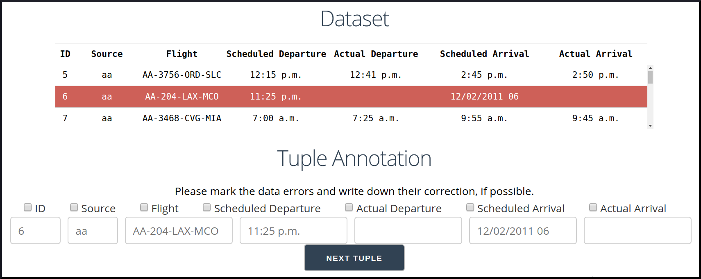
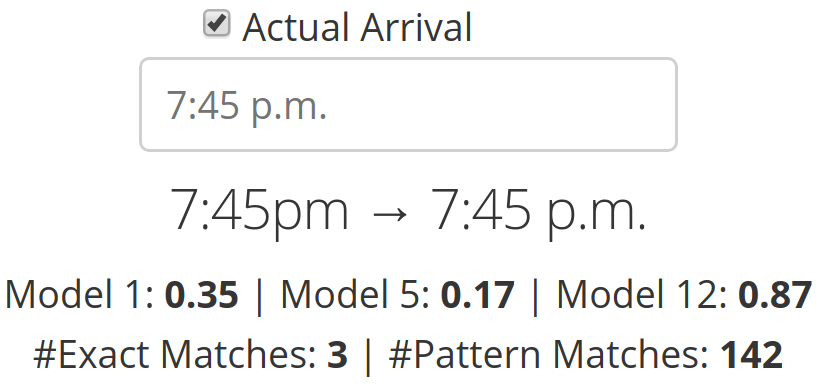

# Baran
Repairing the data errors of a dataset is a challenging task. 
Traditional solutions leverage handmaid rules or master data to find the correct values. Both are often amiss in real-world scenarios. Therefore, it is desirable to additionally learn corrections from a limited number of example repairs. To effectively generalize example repairs, it is necessary to capture the entire context of each erroneous value. A context comprises the value itself, the co-occurring values inside the same tuple, and all values that define the attribute type. Typically, a corrector based on any of these context information undergoes an individual process of operations that is not always easy to integrate with other types of correctors.

Baran is a new context-aware error correction system, which provides a unifying abstraction for integrating multiple corrector models that can be updated in the same way and benefit from transfer learning. Because of the holistic nature of our approach, we can generate more correction candidates than state of the art, and because of the underlying context-aware data representation, we achieve high precision. Using transfer learning based on corrections in the Wikipedia page revision history, our system can further improve its overall performance in terms of precision and recall.

## Usage
The full documentation and a user interface is `coming soon`.
   
   
   

## Related Projects
Check out [Raha](https://github.com/bigdama/raha).
